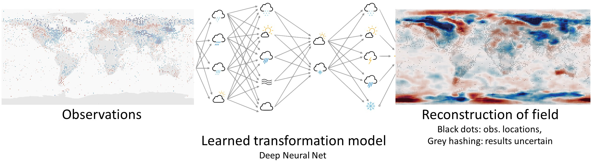
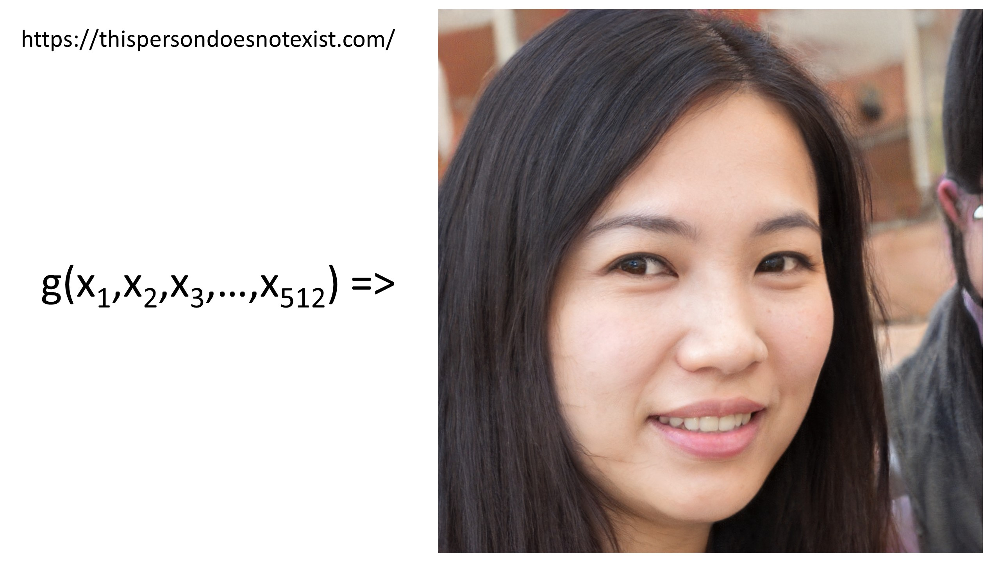
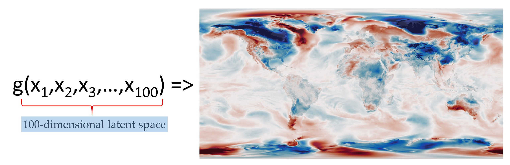
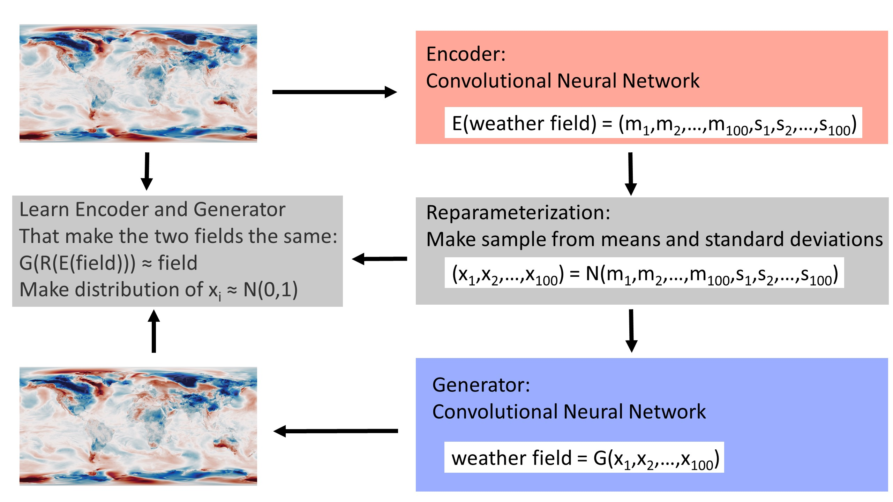

Machine Learning for Data Assimilation
======================================

`Reanalysis <https://reanalyses.org>`_ is awesome, but it's very slow and very expensive. We can make it dramatically easier and cheaper with `Machine Learning <https://en.wikipedia.org/wiki/Machine_learning>`_.

Introduction
------------

We would like to know the weather everywhere in the world, for every hour in the last 100 years at least. But for most times, and most places, we have no observations of the weather. So we need to use the observations we do have as efficiently as possible - we need to make each observation inform our estimates of the weather in places remote from the observation. A powerful technique for this is `Data Assimilation (DA) <https://en.wikipedia.org/wiki/Data_assimilation>`_ which starts from a model of the weather, and uses observations to constrain the state of the model. Using DA with `General circulation Models (GCMs) <https://en.wikipedia.org/wiki/General_circulation_model>`_ has been enormously successful, providing precise and accurate estimates of global weather, operational weather forecasts, comprehensive modern reanalyses such as `ERA5 <https://www.ecmwf.int/en/forecasts/datasets/reanalysis-datasets/era5>`_ and long sparse-observation reanalyses such as the `Twentieth Century Reanalysis (20CR) <https://psl.noaa.gov/data/20thC_Rean/>`_.
But GCMs are complex to use and expensive to run. Reanalysis projects require specialist expertise and enormous quantities of supercomputer time, so this technology, despite its power, is not very widely used. We already know that that we can use Machine Learning (ML) to make `fast approximations to a GCM <https://brohan.org/ML_GCM/>`_, can we extend this to do DA as well?

Here I show that you can use a `Variational AutoEncoder (VAE) <https://en.wikipedia.org/wiki/Variational_autoencoder>`_ to build a fast `deep generative model <https://en.wikipedia.org/wiki/Generative_model#Deep_generative_models>`_ linking physically-plausible weather fields to a complete, continuous, low-dimensional latent space. Data Assimilation can then be done by searching the latent space for the state that maximises the fit between the linked field and the observations. The DA process takes about 1 minute on a standard laptop.

Generative model, and latent space
----------------------------------

The objective is to transform a set of observations to the underlying weather field. More reasonably, we want an estimate of the underlying field and a measure of the uncertainty of that estimate. So there is some function ``f()`` where:

.. figure:: figures/f_obs_map_to_field.jpg
   :width: 95%
   :align: center
   :figwidth: 95%

(Here, as in all these examples, the field is the 2m air temperature (T2m) anomaly, from ERA5, at a 0.25 degree resolution). We can also express this as:

.. figure:: figures/f_obs_txt_to_field.jpg
   :width: 95%
   :align: center
   :figwidth: 95%

Where each ``O`` is a triplet of (lat, lon, T2m anomaly) and ``n`` is a variable - we need to be able to use any number of observations. The challenge is to use ML to make a suitable ``f()``.

We are going to replace the GCM with a generative model. Recent work in ML has generated some terrifyingly good generative models. The person below, for example, `does not exist <https://this-person-does-not-exist.com/en>`_.

.. figure:: figures/Person_that_does_not_exist.jpg
   :width: 60%
   :align: center
   :figwidth: 60%

This picture is not a photograph, it is the output from an ML model (`StyleGAN2 <https://github.com/NVlabs/stylegan2>`_, via `this-person-does-not-exist.com <https://this-person-does-not-exist.com/en>`_). The model here is serving as a function that takes 512 numbers as an input (usually generated at random) and converts them into a photo-realistic picture. We call this function a generator - ``g()``.

The inputs ``X`` form a vector in 512-dimensional space. We call this input space the *latent space* and the model is trained to map any point in this space into a photo-realistic picture. (Strictly, any point close to the origin - the ``X`` should be a sample from a multivariate normal distribution with mean 0 and variance 1).

If we can do this for photos of faces, then we can do it for weather fields (ERA5 T2m anomaly). The temperature field is much simpler than the face picture, so I'm reducing the latent space dimension to 100 (arbitrary, makes training easier and faster), but otherwise we can build the same generator function for that.

I'm going to create this generator - ``g()`` - using a `Variational AutoEncoder (VAE) <https://en.wikipedia.org/wiki/Variational_autoencoder>`_. An autoencoder is a pair of neural nets: one of them (the encoder) compresses an input field into the low-dimensional latent space, and the other (the generator) expands the small latent space representation back into the input field. They are trained as a pair - optimising to make generator(encoder(input)) as close to the original input as possible. A variational autoencoder is an autoencoder where the latent space is constrained to be continuous (two close points in the latent space should produce two similar states when decoded), and complete (any point sampled from the latent space should give a plausible T2m anomaly field if used as input to the generator). This means the generator network can be used independently of the encoder to make new states similar to the original inputs. 

.. toctree::
   :titlesonly:
   :maxdepth: 1

   Details: Building and training the VAE <model>

Training a simple VAE on 40 years of daily T2m anomalies (from ERA5) gives decent results after only about 10 minutes (on a single v100 GPU).

.. figure:: figures/DCVAE_validation.jpg
   :width: 95%
   :align: center
   :figwidth: 95%

   VAE validation: top left - original field, top right - generator output, bottom left - difference, bottom right - scatter original::output. (Note that a substantially better result could be produced with more model-building effort and a larger latent space, but this is good enough for present purposes).

The successful  model training means that the generator half of the VAE can serve as our ``g()`` taking any point in a 100-dimensional latent space (close to the origin, as above) and mapping it to a never-before-seen, but physically-plausible, daily T2m anomaly field. Importantly, this ``g()`` is both accurate and *fast*  - sample weather fields can be produced in a small fraction of a second.

.. figure:: figures/DCVAE_to_g_latent.jpg
   :width: 95%
   :align: center
   :figwidth: 95%

Assimilating through the latent space
-------------------------------------

But we don't want ``g()`` - the function making a weather field from a latent space vector; we want ``f()`` - a function making a weather field from a variable set of observations. The virtue of having ``g()``, is that it allows us to convert the problem from finding a weather field that matches the observations, to finding a point in latent space that generates a weather field that matches the observations - we map observations to latent space vector to field. That is, we can look for the solution in the latent space, rather than in the real-space weather field.

.. figure:: figures/f_obs_to_latent_to_field.jpg
   :width: 95%
   :align: center
   :figwidth: 95%

This is a gain because the latent space, unlike real space, is *complete* and *continuous*. We can't just perturb the real-space weather field to make a field that matches observations - there are a large number of real-space fields that match the observations, but almost all of them are physically-impossible, they don't represent plausible weather states. The latent space does not have this problem, every point in latent space represents a plausible weather state. So if we can find a point in latent space which, when used as input to ``g()``, produces a real-space field that matches the observations, that real space field is a satisfactory solution to the assimilation problem. And because the latent space is also continuous, we can search for the best point in latent space with an `optimiser <https://en.wikipedia.org/wiki/Mathematical_optimization>`_, which means we can find the best-fit latent space vector (and so weather state) efficiently. For this example case (100-dimensional latent space representation of ERA5 T2m, fit to a few thousand observations), it takes in only about 100 iterations (i.e. about 100 calls of the generator) - and because ``g()`` is very fast, the whole process takes little time, less than one minute on a standard laptop (no GPU).

.. figure:: figures/Optimiser.jpg
   :width: 95%
   :align: center
   :figwidth: 95%

.. toctree::
   :titlesonly:
   :maxdepth: 1

   Details: DA by optimisation in latent space <optimiser>

This optimisation search provides our function ``f()`` and it is simple to extend it to provide uncertainty estimates as well. Call the function several times with different starting guesses for the latent space vector ``X`` (and, if desired, perturbations to the observations to account for their uncertainty), and the resulting ensemble of real space fields provides a sample constrained by the observations.

.. figure:: figures/DCVAE_to_optimiser_to_DA.jpg
   :width: 95%
   :align: center
   :figwidth: 95%

To check that it works, we can make some pseudo-observations from a known field, and see how well we can recover the original field from just the observations:

.. figure:: figures/fit_1969.jpg
   :width: 95%
   :align: center
   :figwidth: 95%

   Assimilation validation: bottom - original field (ERA5 T2m anomaly), top - assimilation results. Black dots mark observations assimilated, grey hatching marks regions where the result is very uncertain. 

This process works as expected. We can reconstruct the weather field precisely in regions where we have observations, and with uncertainty in regions where observations are unavailable.

It's not just T2m - the same approach can be used over a wide range of applications.

Examples of use
---------------

.. toctree::
   :titlesonly:
   :maxdepth: 1

   You don't have to start from GCM output - working with haduk-grid <haduk-grid>
   Assimilating things other than observations - dataset to dataset conversion <conversion>
   Not just T2m - assimilating mslp <mslp>
   Not just one variable - finding mslp by assimilating wind observations <multi-variable>

Conclusions
-----------

Machine Learning makes data assimilation easy, cheap, and fast. The recipe is:

#. Train a variational autoencoder on a sample of the desired output
#. Find a point in latent space which, when run through the resulting generator function, matches the observations.

This is made possible by the new capabilities offered by ML, and particularly the `VAE <https://en.wikipedia.org/wiki/Variational_autoencoder>`_ which provides a straightforward method for creating a latent space, and a generator function ``g()``, which is both expressive and fast. It would be extraordinarily difficult to code such a function by traditional methods.

Small print
-----------

.. toctree::
   :titlesonly:
   :maxdepth: 1

   How to reproduce or extend this work <how_to>
   Authors and acknowledgements <credits>

This document is crown copyright (2022). It is published under the terms of the `Open Government Licence <https://www.nationalarchives.gov.uk/doc/open-government-licence/version/2/>`_. Source code included is published under the terms of the `BSD licence <https://opensource.org/licenses/BSD-2-Clause>`_.
