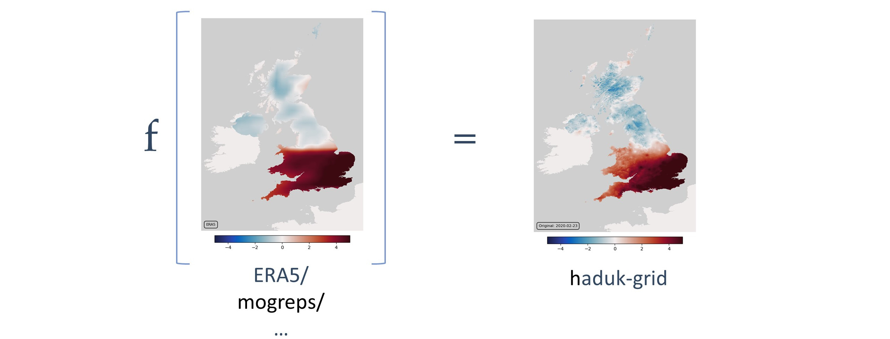
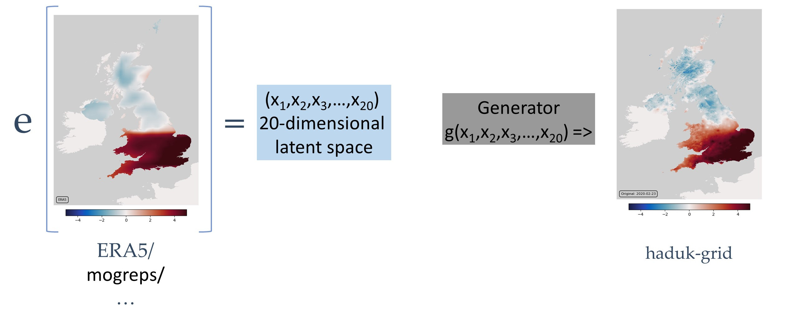
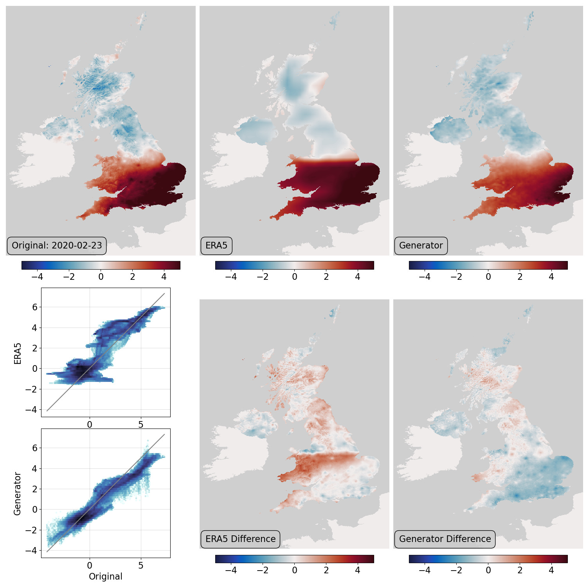

Dataset to dataset conversion
=============================

We've established a way to assimilate observations - using those observations to find the optimum location in latent space. It would be useful to do the same with things other than observations - in particular we would like to use weather forecasts: If we could generate an observational dataset from a weather forecast, we could make the observational dataset several days before the observations became available.

This is essentially a dataset conversion problem - can we convert one gridded field into another? Here I'm going to use ERA5 as the input field, and HadUK-Grid as the target, but the same principle will apply to any pair. So again we need a conversion function ``f()``, but this time it takes a gridded field as input:

And again the trick is to put the latent space into the middle of the problem - we use our input field to specify a point in latent space, and then generate the target field from that point.

For the right hand half of the problem (generating from the latent space) we can use the generator (of HadUK-Grid Tmax) that we have :doc:`already trained <./haduk-grid>`. We could just find the generator output that gives the closest match to the input dataset, but this is only the best thing to do if the input dataset is really good. Most input datasets will have biases - ERA5 clearly does in this example, in particular it's relatively lower resolution means it's missing much of the spatial structure in HadUK-Grid. so we can do better by re-using the whole VAE - we train an encoder to convert ERA5 input to latent space, and then use the generator to produce HadUK-Grid output. The encoder can then learn to allow for biases in ERA5.

So the process is: 

.. toctree::
   :titlesonly:
   :maxdepth: 1

   Get the training data <models/conversion/get_data>
   Convert the training data to tf tensors <models/conversion/to_tensor>
   Package the tensors into a tf Dataset <models/conversion/make_dataset>
   Specify the VAE <models/conversion/VAE>
   Train the VAE <models/conversion/training>
   Validate the trained VAE <models/conversion/validation>

   VAE validation: top left - original field, top centre - ERA5 source field, top right - generator output, bottom right - difference original::generator, bottom centre - difference ERA::generator bottom left - scatter plots. 

This is working pretty well - a plausible HadUK-Grid Tmax field is produced from the ERA5 Tmax field for the same day. And in this case the VAE is tool we want - it does the dataset conversion directly, we don't need a separate optimisation step.
