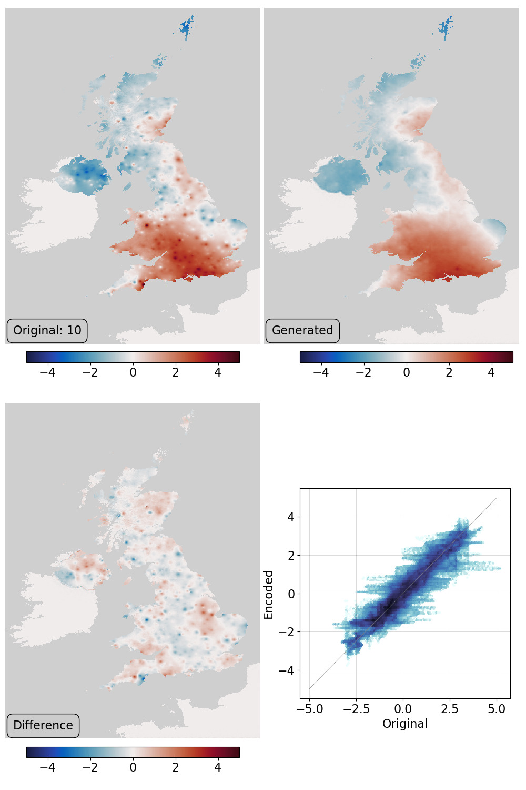
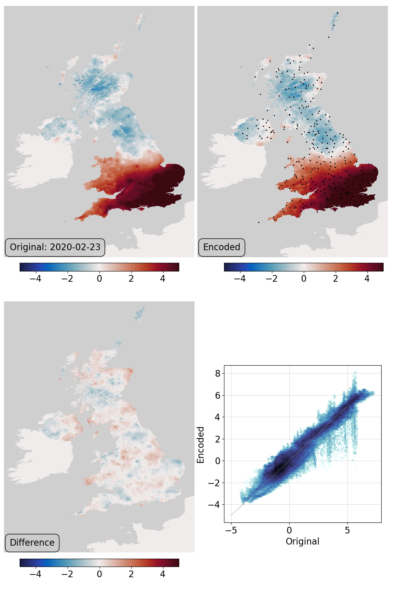
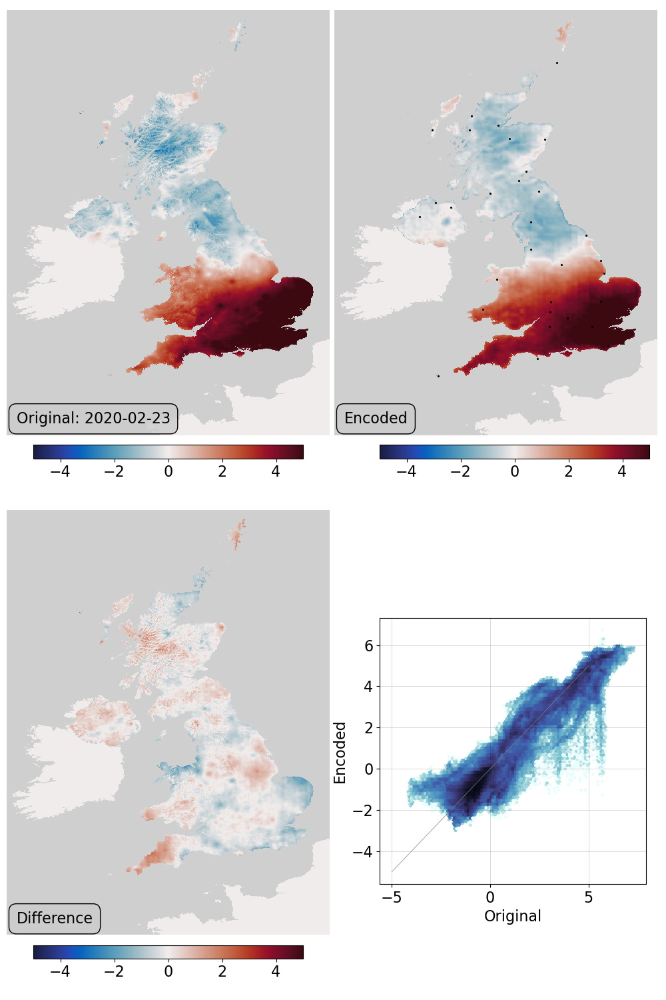

Working with haduk-grid
=======================

A weakness of this ML-reanalysis approach is that we have been using samples from a preexisting reanalysis to train the VAE. This makes the process somewhat circular - it would be more powerful if we could generate the VAE some other way.

One possibility for this is to train the VAE on pure observations, and the easy place to start is with an existing observational dataset - here we are using `HadUK-Grid <https://www.metoffice.gov.uk/research/climate/maps-and-data/data/haduk-grid/haduk-grid>`_, specifically the daily maximum air temperature.

