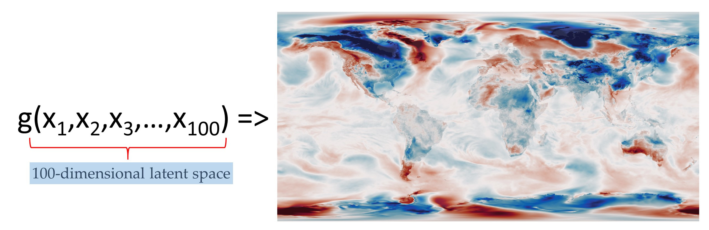
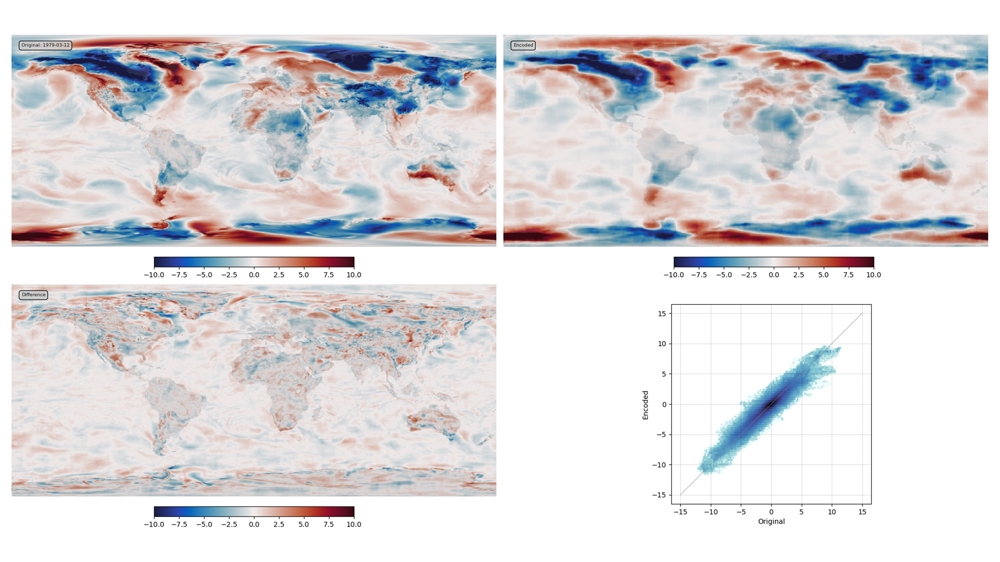
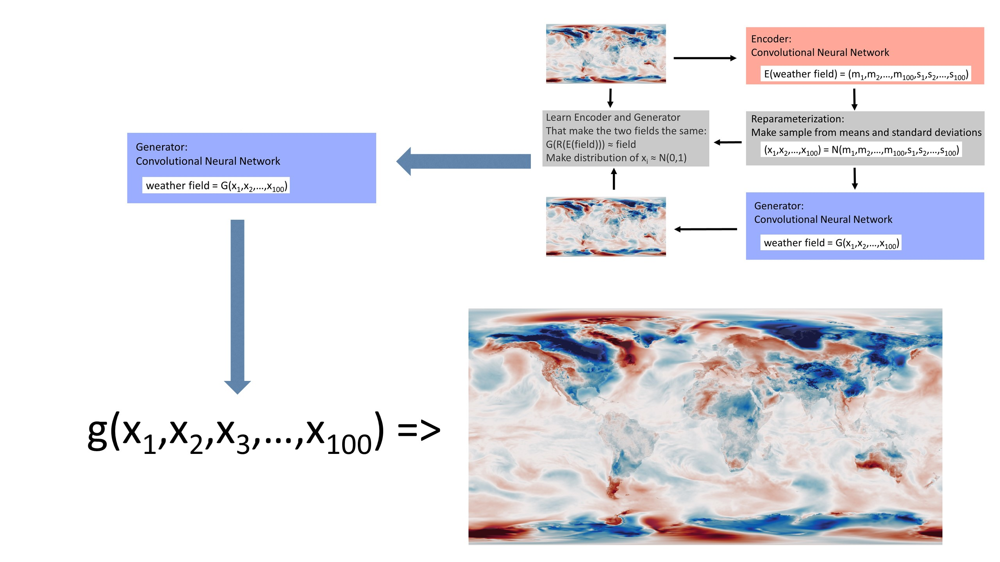
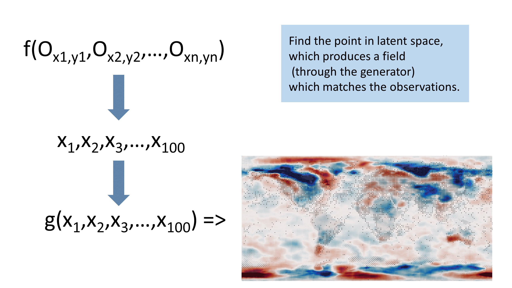

Machine Learning for Data Assimilation
======================================

`Reanalysis <https://reanalyses.org>`_ is awesome, but it's very slow and very expensive. We can make it dramatically easier and cheaper with `Machine Learning <https://en.wikipedia.org/wiki/Machine_learning>`_.

.. figure:: figures/Intro_figure.jpg
   :width: 95%
   :align: center
   :figwidth: 95%

Introduction
------------

We would like to know the weather everywhere in the world, for every hour in the last 100 years at least. But for most times, and most places, we have no observations of the weather. So we need to use the observations we do have as efficiently as possible - we need to make each observation inform our estimates of the weather in places remote from the observation. A powerful technique for this is `Data Assimilation (DA) <https://en.wikipedia.org/wiki/Data_assimilation>`_ which starts from a model of the weather, and uses observations to constrain the state of the model. Using DA with `General circulation Models (GCMs) <https://en.wikipedia.org/wiki/General_circulation_model>`_ has been enormously successful, providing precise and accurate estimates of global weather, operational weather forecasts, comprehensive modern reanalyses such as `ERA5 <https://www.ecmwf.int/en/forecasts/datasets/reanalysis-datasets/era5>`_ and long sparse-observation reanalyses such as the `Twentieth Century Reanalysis (20CR) <https://psl.noaa.gov/data/20thC_Rean/>`_.
But GCMs are complex to use and expensive to run. Reanalysis projects require specialist expertise and enormous quantities of supercomputer time, so this technology, despite its power, is not very widely used. We already know that that we can use Machine Learning (ML) to make `fast approximations to a GCM <https://brohan.org/ML_GCM/>`_, can we extend this to do DA as well?

Here I show that you can use a `Variational AutoEncoder (VAE) <https://en.wikipedia.org/wiki/Variational_autoencoder>`_ to build a fast `deep generative model <https://en.wikipedia.org/wiki/Generative_model#Deep_generative_models>`_ linking physically-plausible weather fields to a complete, continuous, low-dimensional latent space. Data Assimilation can then be done by searching the latent space for the state that maximises the fit between the linked field and the observations. The DA process takes about 1 minute on a standard laptop.

Finding an atmospheric state that matches observations 
------------------------------------------------------

Suppose we have a representation of the atmospheric state :math:`z`, and some observations :math:`y^o`. We'd like to know what values of :math:`z` are consistent with :math:`y^o` - we want the probability distribution function :math:`p(z|y^o)` (or at least the value of :math:`z` that maximises this probability - the best-estimate atmospheric state given the observations).

From Bayes' theorem:

.. math::

   p(z|y^o) = p(y^o|z)p(z)/p(y^o)

where :math:`p(z)` is our prior estimate of :math:`z` (before we got the observations) - sometimes called a "background" estimate. And :math:`p(y^o)` is our prior probability of observations :math:`y^o`.

Start by assuming :math:`p(y^o)` is constant - all values of observations are equally likely. 

To calculate :math:`p(y|z)` we need an observations operator :math:`H`: :math:`y=H(z)`. Suppose :math:`y^o` and the corresponding :math:`H(z)` contain Gaussian errors with covariance :math:`R`. Then

.. math::

   p(y^o|z) \propto \exp(-1/2(y^o-H(z))^TR^{-1}(y^o-H(z))

We also need a prior estimate :math:`p(z)` for the atmospheric state. This is a property of the model we are using to represent the atmosphere. Our atmospheric state :math:`z` will be the output of a model (call this :math:`g`):

.. math::

   z = g(x)

where :math:`x` is the state vector of the model. A useful model :math:`g()` will have three properties:

* It will produce precise and accurate estimates of the atmospheric state :math:`z`. In practice this means :math:`p(y^o|z)` is small compared to alternative models.
* It will be cheap and easy to estimate :math:`p(y^o|z)` - how well the model fits the observations.
* It will be cheap and easy to estimate :math:`p(z)` - the prior estimate of the atmospheric state.

Modern `GCMs <https://en.wikipedia.org/wiki/General_circulation_model>`_ score very highly on the first of these points - they make very precise and accurate estimates of the atmospheric state vector - but nothing about them is cheap, or easy. On the other hand, simple statistical models can make fast estimates of :math:`p(y^o|z)` and :math:`p(z)` (and so allow fast estimates of the :math:`z` that maximises :math:`p(z|y^o)`) but the quality of the atmospheric states they produce are unsatisfactory.

Modern `Machine Learning (ML) <https://en.wikipedia.org/wiki/Machine_learning>`_ offers us the chance to square this circle: simple :math:`p(z)`, fast estimates of :math:`p(y^o|z)` (and so :math:`p(z|y^o)`), and good quality atmospheric state estimates. Speed, accuracy, and precision.

A concrete example: 2-metre air temperature
-------------------------------------------

As a concrete example, we will use not the whole weather state vector, but just the 2-metre air temperature anomaly (as our :math:`z`). And we will use station observations of 2-metre temperature to constrain it.  So there is some function :math:`f()` where:

.. figure:: figures/f_obs_map_to_field.jpg
   :width: 95%
   :align: center
   :figwidth: 95%

Or

.. figure:: figures/f_obs_txt_to_field.jpg
   :width: 95%
   :align: center
   :figwidth: 95%

Where each :math:`o` is a triplet of (lat, lon, T2m anomaly) and :math:`n` is a variable - we need to be able to use any number of observations. The challenge is to use ML to make a suitable :math:`f()`, that is, one where :math:`f(y^o) = z^o`, where :math:`z^o` is the value of :math:`z` that maximises :math:`p(z|y^o)`

This example has the virtue that the observations operator :math:`H(z)` is very simple - we just interpolate :math:`z` to the locations of the observations. Also we can reasonably assume the observations errors are constant and uncorrelated, so maximising :math:`p(y^o|z)` is the same as minimising the RMS difference between :math:`H(z)` and :math:`y^o`. That is, between the observations and the field :math:`z` at the locations of the observations.

Generative model, and latent space
----------------------------------

Traditionally, we would use a GCM to generate plausible temperature fields (:math:`z`). Here, we are going to replace the GCM with a generative model: We need a model :math:`z=g(x)`, where a cheap and simple prior input distribution :math:`p(x)` produces a wide range of good quality output temperature fields (the same sort of output a good GCM might produce, or that we see in observations).

So let's say that the model state vector :math:`x` has 100-elements, and the prior :math:`p(x)` is a multivariate normal distribution with mean 0 and variance 1.

This function is called a generator, and the  inputs :math:`x` form a vector in 100-dimensional space (the *latent space*). There are three additional requirements on :math:`g()`: We want to be able to perturb the state, so it must be continuous - a small change in the latent space (:math:`x`) must result in a small change in the output (:math:`z`). We want to sample freely from the prior, so it must be complete - any point in the latent space (sampled from the prior) must map into a plausible temperature anomaly field. And it must be *fast* (otherwise, we could just use a GCM).

This function is specified to meet the three requirements above (good quality :math:`z`, cheap and easy :math:`p(z)`, and cheap and easy :math:`p(y^o|z)`). It would be almost impossible to code a function meeting this specification, but we don't have to write the function, we can *learn* it.

Learning a generator with a Variational AutoEncoder
---------------------------------------------------

We can create a generator with exactly these properties, using a `Variational AutoEncoder (VAE) <https://en.wikipedia.org/wiki/Variational_autoencoder>`_. An autoencoder is a pair of neural nets: one of them (the encoder) compresses an input field into a low-dimensional latent space, and the other (the generator) expands the small latent space representation back into the input field. They are trained as a pair - optimising to make generator(encoder(input)) as close to the original input as possible. A variational autoencoder adds two complications to the basic autoencoder: The encoder outputs a distribution in latent space not a point (the distribution is parametrized by its mean :math:`m` and standard deviation :math:`s`) and it is trained not just to produce the desired output, but also to produce the desired distribution in latent space (:math:`p(x)`) - a multi-variate unit normal distribution.

.. figure:: figures/DCVAE.jpg
   :width: 95%
   :align: center
   :figwidth: 95%

.. toctree::
   :titlesonly:
   :maxdepth: 1

   Details: Building and training the VAE <model>

The generator produced by training meets the requirements specified above:

* It makes good quality :math:`z` as output, because we train it on examples of good quality :math:`z` - here temperature anomaly fields from `ERA5 <https://www.ecmwf.int/en/forecasts/datasets/reanalysis-datasets/era5>`_.
* It has a cheap and easy :math:`p(z)`, because we train :math:`p(x)` (and so :math:`p(z)`) to be a multi-variate unit normal distribution.
* It is continuous and complete because of the variational construction (noise in the encoder output, and constraint on the latent space distribution).
* It is fast because the generator is implemented as a `convolutional neural net (CNN) <https://en.wikipedia.org/wiki/Convolutional_neural_network>`_. (It runs in much less than one second).
* It has cheap and easy :math:`p(y^o|z)` because it is fast and complete - it's cheap and easy to make samples of :math:`z` and so :math:`H(z)`.

So as long as as the VAE can be trained successfully on good quality data (examples of the sort of :math:`z` that we want it to produce), the generator learned by the VAE will be exactly the function :math:`g()` that we need. And it does work: training a simple VAE on 40 years of daily T2m anomalies (from ERA5) gives decent results after only about 10 minutes (on a single v100 GPU).

   VAE validation: top left - original field, top right - generator output, bottom left - difference, bottom right - scatter original::output. (Note that a substantially better result could be produced with more model-building effort and a larger latent space, but this is good enough for present purposes).

The VAE is serving as a generator factory - learning a generator function :math:`g()` that has all the properties we need, from observations of the weather variable of interest (T2m anomalies from ERA5).

Assimilating through the latent space
-------------------------------------

But we don't want :math:`g()` - the function making a weather field from a latent space vector; we want :math:`f()` - a function making a weather field from a variable set of observations. The virtue of having :math:`g()`, is that it allows us to convert the problem from finding a weather field that matches the observations, to finding a point in latent space that generates a weather field that matches the observations - we map observations to latent space vector to field. That is, we can look for the solution in the latent space, rather than in the real-space weather field.

We want to find the value of :math:`z` which maximises:

.. math::

   p(z|y^o) & = p(y^o|z)p(z)/p(y^o) \\
            & \propto \exp(-{1\over2}(y^o-H(z))^TR^{-1}(y^o-H(z))p(z) \\
            & \approx \exp(-{1\over2}(y^o-H(z))^2)p(z)

and :math:`z=g(x)` so we need the value of x which maximises:

.. math::

             \exp(-{1\over2}(y^o-H(g(x)))^2)p(x)

We have :math:`g(x)` - the generator we learned with the VAE; :math:`p(x)` is a unit normal distribution; and :math:`H(g(x))` is very simple - we just interpolate the generator output to the locations of the observations. So we can calculate this for any :math:`x` and finding the maximum is just a matter of optimisation.
Because :math:`g(x)` is fast, complete, and continuous (by design), it's an *easy* optimisation problem - we can use `gradient descent <https://en.wikipedia.org/wiki/Gradient_descent>`_. For this example (100-dimensional latent space representation of T2m, fit to a few thousand observations), it takes only about 100 iterations (i.e. about 100 calls of the generator), and about one minute on a standard laptop (no GPU).

.. figure:: figures/Optimiser.jpg
   :width: 95%
   :align: center
   :figwidth: 95%

.. toctree::
   :titlesonly:
   :maxdepth: 1

   Details: DA by optimisation in latent space <optimiser>

This optimisation search provides our function :math:`f()` and it is simple to extend it to provide uncertainty estimates as well. Call the function several times with different starting guesses for the latent space vector :math:`x` (and, if desired, perturbations to the observations to account for their uncertainty), and the resulting ensemble of real space fields provides a sample constrained by the observations.

To check that it works, we can make some pseudo-observations from a known field, and see how well we can recover the original field from just the observations:

.. figure:: figures/fit_1969.jpg
   :width: 95%
   :align: center
   :figwidth: 95%

   Assimilation validation: bottom - original field (ERA5 T2m anomaly), top - assimilation results. Black dots mark observations assimilated, grey hatching marks regions where the result is very uncertain. 

This process works as expected. We can reconstruct the weather field precisely in regions where we have observations, and with uncertainty in regions where observations are unavailable.

It's not just 2-metre air temperature - the same approach can be used over a wide range of applications.

Examples of use
---------------

.. toctree::
   :titlesonly:
   :maxdepth: 1

   You don't have to start from GCM output - working with haduk-grid <haduk-grid>
   Assimilating things other than observations - dataset to dataset conversion <conversion>
   Not just T2m - assimilating mslp <mslp>
   Not just one variable - finding mslp by assimilating wind observations <multi-variable>

How far can we go with this method? In principle the same method could be used for very large and complex sets of weather and observation fields (including satellite radiances). We can be confident that suitable generator functions are possible because they would be neural network approximations to GCMs that already exist. But it's not yet clear how difficult it would be to train such functions. 

Conclusions
-----------

Machine Learning makes data assimilation easy, cheap, and fast. 

Data assimilation means finding a weather field :math:`z` that is the best fit to a set of observations :math:`y^o`. This means maximising

.. math::

   p(y^o|z)p(z)

and this is difficult because :math:`p(z)`, the prior probability of any particular weather field, is hard to calculate. Most fields of temperature, wind etc. are physically or dynamically impossible - they don't represent weather states that could occur in reality (i.e. :math:`p(z)=0`). So we can't find a maximum of this expression by searching in z - we'd need a fast functional representation of :math:`p(z)`, and we don't have one.

Machine learning provides us with a function :math:`z=g(x)` that lets us transform the problem into the latent space :math:`x`, where :math:`p(x)` is an easy function. So maximising

.. math::

   p(y^o|x)p(x)

is straightforward. Producing such a function :math:`g()` by traditional methods would be extraordinarily difficult, but we can *learn* such a function quite easily, with a Variational Autoencoder trained on observations.

Small print
-----------

.. toctree::
   :titlesonly:
   :maxdepth: 1

   How to reproduce or extend this work <how_to>
   Authors and acknowledgements <credits>

This document is crown copyright (2022). It is published under the terms of the `Open Government Licence <https://www.nationalarchives.gov.uk/doc/open-government-licence/version/2/>`_. Source code included is published under the terms of the `BSD licence <https://opensource.org/licenses/BSD-2-Clause>`_.

