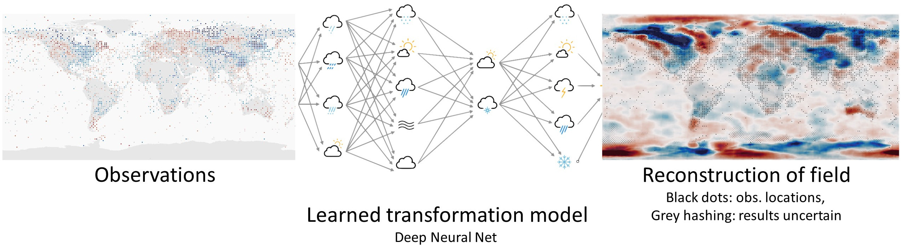
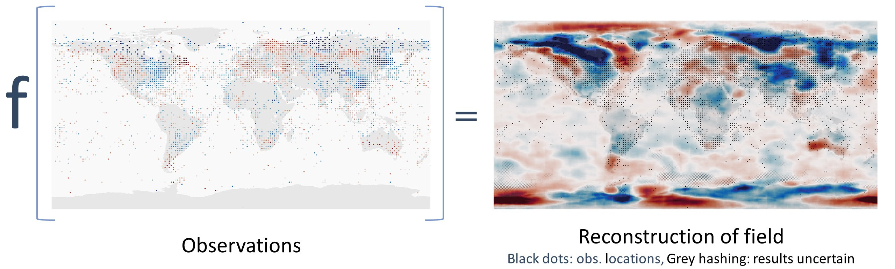
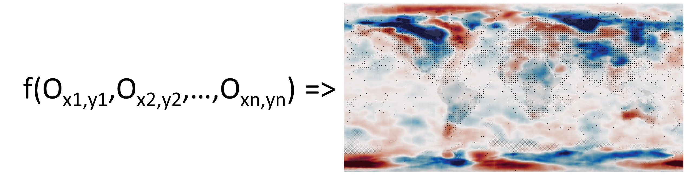
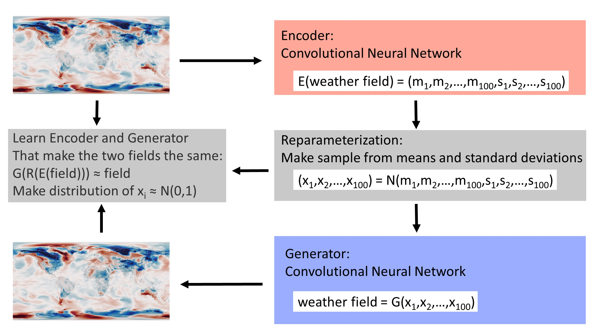
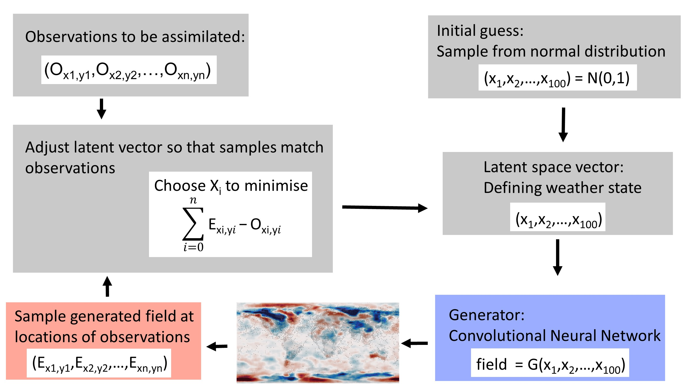
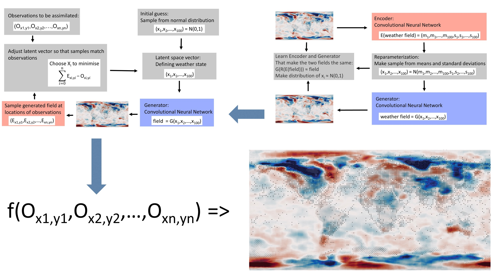
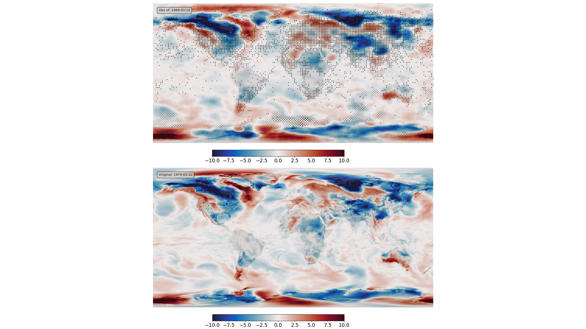

Machine Learning for Data Assimilation
======================================

`Reanalysis <https://reanalyses.org>`_ is awesome, but it's very slow and very expensive. We can make it dramatically easier and cheaper with `Machine Learning <https://en.wikipedia.org/wiki/Machine_learning>`_.

We would like to know the weather everywhere in the world, for every hour in the last 100 years at least. But for most times, and most places, we have no observations of the weather. So we need to use the observations we do have as efficiently as possible - we need to make each observation inform our estimates of the weather in places remote from the observation. A powerful technique for this is `Data Assimilation (DA) <https://en.wikipedia.org/wiki/Data_assimilation>`_ which starts from a model of the weather, and uses observations to constrain the state of the model. Using DA with `General circulation Models (GCMs) <https://en.wikipedia.org/wiki/General_circulation_model>`_ has been enormously successful, providing precise and accurate estimates of global weather, operational weather forecasts, comprehensive modern reanalyses such as `ERA5 <https://www.ecmwf.int/en/forecasts/datasets/reanalysis-datasets/era5>`_ and long sparse-observation reanalyses such as the `Twentieth Century Reanalysis (20CR) <https://psl.noaa.gov/data/20thC_Rean/>`_.
But GCMs are complex to use and expensive to run. Reanalysis projects require specialist expertise and enormous quantities of supercomputer time, so this technology, despite its power, is not very widely used. We already know that that we can use Machine Learning (ML) to make `fast approximations to a GCM <https://brohan.org/ML_GCM/>`_, can we extend this to do DA as well?

Here I show that you can use a `Variational AutoEncoder (VAE) <https://en.wikipedia.org/wiki/Variational_autoencoder>`_ to build a fast `deep generative model <https://en.wikipedia.org/wiki/Generative_model#Deep_generative_models>`_ linking physically-plausible weather fields to a complete, continuous, low-dimensional latent space. Data Assimilation can then be done by searching the latent space for the state that maximises the fit between the linked field and the observations. The DA process takes about 1 minute on a standard laptop.

Generative model, and latent space
----------------------------------

The objective is to transform a set of observations to the underlying weather field. More reasonably, we want an estimate of the underlying field and a measure of the uncertainty of that estimate. So there is some function ``f()`` where:

(Here, as in all these examples, the field is the 2m air temperature (T2m) anomaly, from ERA5, at a 0.25 degree resolution). We can also express this as:

Where each ``O`` is a triplet of (lat, lon, T2m anomaly) and ``n`` is a variable - we need to be able to use any number of observations. The challenge is to use ML to make a suitable ``f()``.

We are going to replace the GCM with a generative model. Recent work in ML has generated some terrifyingly good generative models. The person below, for example, `does not exist <https://this-person-does-not-exist.com/en>`_.

This face is not a photograph, it is the output from an ML model (`StyleGAN2 <https://github.com/NVlabs/stylegan2>`_, via `this-person-does-not-exist.com <https://this-person-does-not-exist.com/en>`_). The model here is serving as a function that takes 512 numbers as an input (usually generated at random) and converts them into a photo-realistic picture.

.. figure:: figures/f_to_tpdne.jpg
   :width: 85%
   :align: center
   :figwidth: 85%

The inputs ``X`` form a vector in 512-dimensional space. We call this input space the *latent space* and the model is trained to map any point in this space into a photo-realistic picture. (Strictly, any point close to the origin - the ``X`` should be a sample from a multivariate normal distribution with mean 0 and variance 1).

If we can do this for photos of faces, then we can do it for weather fields (ERA5 T2m anomaly). he temperature field is much simpler than the photo, so I'm reducing the latent space dimension to 100 (arbitrary, makes training easier and faster), but otherwise we can build the same function for that.

.. figure:: figures/f_ls_to_t2m.jpg
   :width: 95%
   :align: center
   :figwidth: 95%

I'm going to train ``f()`` using a `Variational AutoEncoder (VAE) <https://en.wikipedia.org/wiki/Variational_autoencoder>`_. An autoencoder is a pair of neural nets: one of them (the encoder) compresses an input field into the low-dimensional latent space, and the other (the generator or decoder) expands the small latent space representation back into the input field. They are trained as a pair - optimising to make generator(encoder(input)) as close to the original input as possible. A variational autoencoder is an autoencoder where the latent space is constrained to be continuous (two close points in the latent space should produce two similar states when decoded), and complete (any point sampled from the latent space should give ‘meaningful’ content once decoded). This means the generator network can be used independently of the encoder to generate new states similar to the original inputs.

.. toctree::
   :titlesonly:
   :maxdepth: 1

   Details: Building and training the VAE <model>

Training the VAE on 40 years for daily T2m anomalies (from ERA5) means that the generator half of the VAE can serve as our ``f()`` taking any point in a 10-dimensional latent space (close to the origin, as above) and mapping it to a physically-plausible daily T2m anomaly field.

.. figure:: figures/DCVAE_to_f_latent.jpg
   :width: 95%
   :align: center
   :figwidth: 95%

.. toctree::
   :titlesonly:
   :maxdepth: 1

   Introduction: Why MLDA? <intro>
   Getting training data <data>
   Building a generative model <model>
   Pseudo-observations for assimilation <pseudo_observations>
   Data Assimilation with Machine Learning <data_assimilation>
   Applications: Why MLDA? <applications>

|

.. toctree::
   :titlesonly:
   :maxdepth: 1

   How to reproduce or extend this work <how_to>
   Authors and acknowledgements <credits>

This document is crown copyright (2021). It is published under the terms of the `Open Government Licence <https://www.nationalarchives.gov.uk/doc/open-government-licence/version/2/>`_. Source code included is published under the terms of the `BSD licence <https://opensource.org/licenses/BSD-2-Clause>`_.
