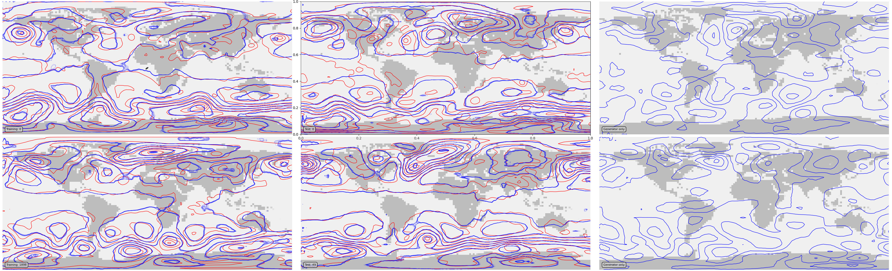

Mean-sea-level pressure - validate the trained VAE
==================================================

   VAE validation: Red contours are from the input dataset, blue contours show generator output. The two left hand plots show comparisons of two cases from the training dataset, the middle plots two cases from the test dataset, and the right hand plots two examples of generator output. 

Script to make the validation figure

.. literalinclude:: ../../../models/DCVAE_single_PRMSL/validation/validate.py

Utility functions used in the plot

.. literalinclude:: ../../../models/DCVAE_single_PRMSL/validation/plot_prmsl_comparison.py

