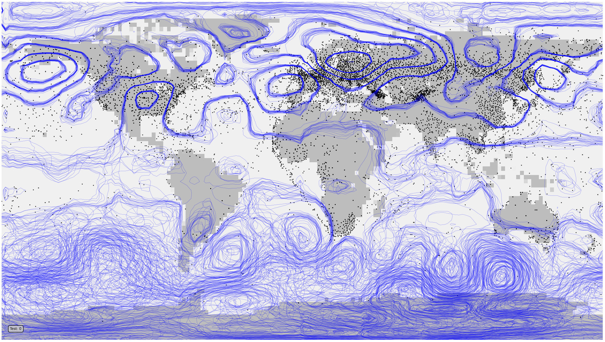

Assimilating mean-sea-level pressure
====================================

What if we try a different variable? I'm going to look at mean-sea-level pressure (mslp) from the `20th Century Reanalysis version 2c <https://psl.noaa.gov/data/gridded/data.20thC_ReanV2c.html>`_.

The process is the same as :doc:`with ERA5 global T2m data <../model>` except that the data format is slightly different (much lower resolution). mslp has less high-spatial-frequency variability than T2m, and we're going to take advantage of that by plotting it as contour plots and `spaghetti plots <https://brohan.org/offline_assimilation/analyses/spaghetti_contour/spaghetti_contour.html>`_ which show differences more clearly.

.. toctree::
   :titlesonly:
   :maxdepth: 1

   Get the training data <models/mslp/get_data>
   Convert the training data to tf tensors <models/mslp/to_tensor>
   Package the tensors into a tf Dataset <models/mslp/make_dataset>
   Specify the VAE <models/mslp/VAE>
   Train the VAE <models/mslp/training>
   Validate the trained VAE <models/mslp/validation>

.. figure:: figures/mslp/comparison.jpg
   :width: 95%
   :align: center
   :figwidth: 95%

   VAE validation: Red contours are from the input dataset, blue contours show generator output. The two left hand plots show comparisons of two cases from the training dataset, the middle plots two cases from the test dataset, and the right hand plots two examples of generator output. 

Assimilation is done exactly as :doc:`with ERA5 global T2m data <../optimiser>`.

.. toctree::
   :titlesonly:
   :maxdepth: 1

   Details: DA by optimisation in latent space <models/mslp/optimiser>

   Assimilation validation: Red contours are from the input dataset, blue contours show generator output - for each of 25 samples with a different starting point in latent space. Black dots mark the locations of observations assimilated.

As with T2m the assimilation works as expected - constraining the generated mslp field in locations lose to observations, but not in regions where there are no observations.

