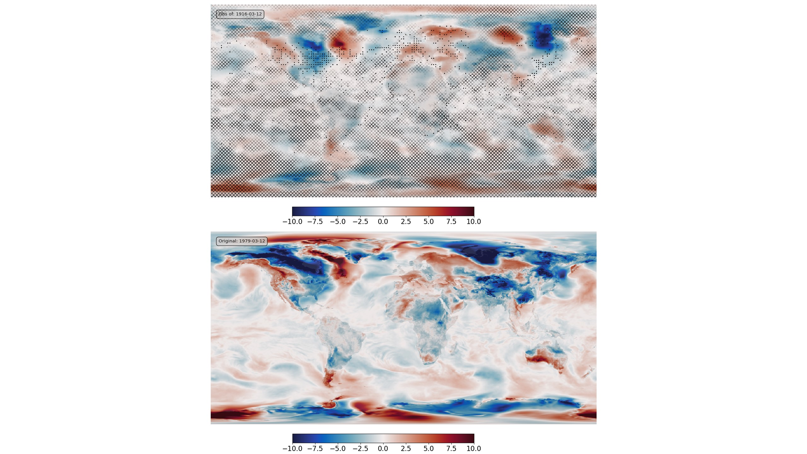

Data Assimilation by optimisation in latent space
==================================================

   Bottom - original field (ERA5 T2m anomaly), top - assimilation results. Black dots mark observations assimilated (surface obs (ISPD) coverage for 1916), grey hatching marks regions where the result is very uncertain.

Script to find the optimal latent-space location and make the validation figure:

.. literalinclude:: ../models/DCVAE_single_ERA5_T2m/fit_to_pseudo_obs/fit_multi.py
